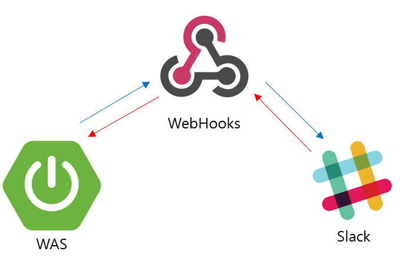
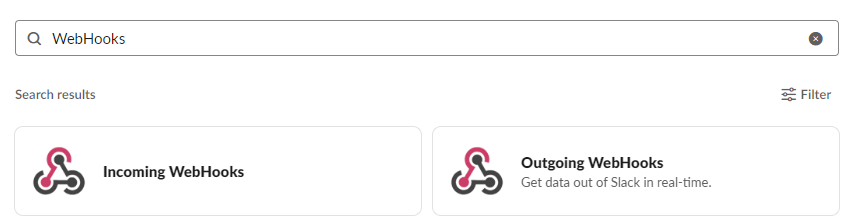
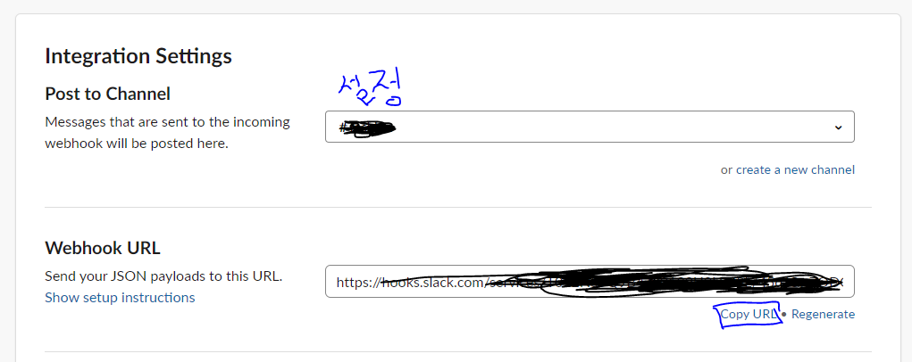
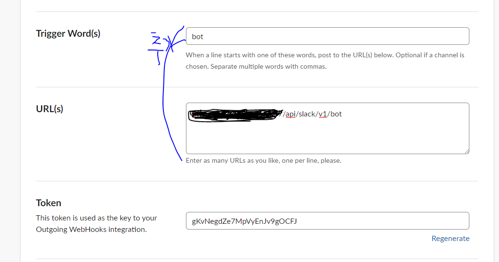
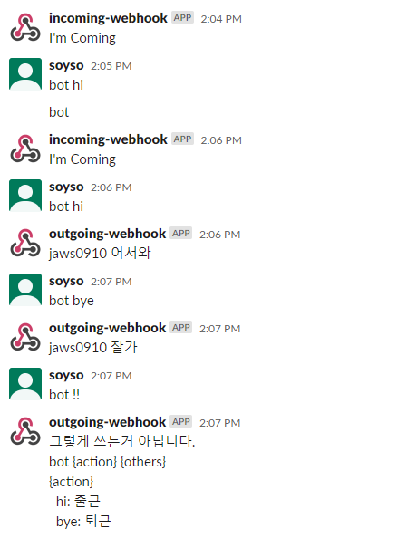

# Slack WebHook

## Slack WebHook을 이용 이유
Slack에 채팅봇을 만들고 싶었지만 Slack App을 전부 구현하지나 배보다 배꼽이 커지고   
간단한 방법이 없나 찾아보니 WebHook이라는 것이 있었다.
   
체팅봇의 내용을 처리해줄 Spring Boot Server를 올려두고 WebHook을 이용해 Slack과 통신하는 방식이였다.
WebHook이라는 용어가 처음이라면 다음 글을 읽어보는 것을 추천한다.
* https://kswims.tistory.com/143

## WebHook App 추가하기
1.    
    체널 리스트에서 아래쪽을 보면 있다.
2. 
    Incoming과 Outgoing 둘 다 추가해주면 된다.

## Incoming? Outgoing?
* Incoming WebHooks는 서버에서 Incoming WebHooks의 URI에 Post 메시지를 보내면 Slack 채널에 그 내용을 보여준다.
* Outgoing WebHooks은 특정 키워드가 Channel에 입력되면 지정해놓은 URI에 Post방식으로 요청한다.

## 그래서 어떻게 쓰는데?
일단 예제 소스를 만들었다. [여기]()
필수 설정값을 채워주시고 실행하면 된다.

위에 방식대로 Incoming, outgoing Hooks을 추가 후에 
1. outgoing WebHooks 설정
      

2. outgoing WebHooks 설정
   

3. application-slack.properties을 채워준다.
    ```
    slack.webHook_input_url=
    slack.webHook_output_token=
    ```

4. 서버를 실행후 확인해보면
   


## 후기
* 앞으로 업무 자동화를 할 때 WebHooks를 적극적으로 이용할 생각이다.
    글을 작성후 회사에서 서버의 모니터링을 하는 봇을 만들었다.    
    아직 초기버전이라 URL요청 후 Status는 200인지 확인하는 정도지만 말이다...


